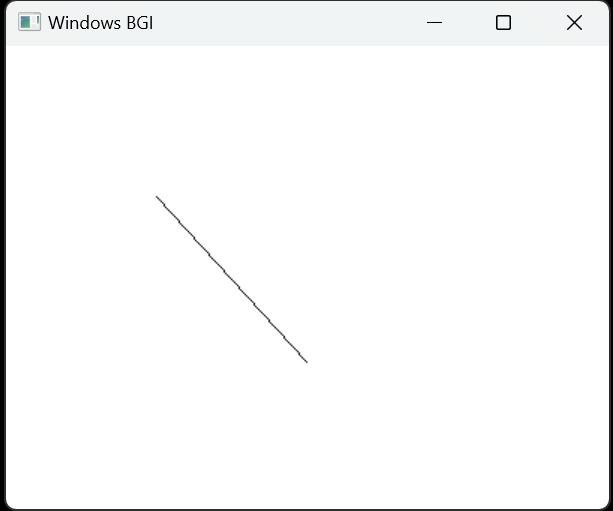

# DDA Algorithm (Digital Differential Analyzer)

The **Digital Differential Analyzer (DDA)** algorithm is one of the simplest line-drawing algorithms. Given the starting and ending coordinates of a line, DDA can efficiently compute the intermediate points to draw the line.

## Algorithm Overview

### Given:
- Starting coordinates: `(X0, Y0)`
- Ending coordinates: `(Xn, Yn)`
- Initial values: `Xp = X0`, `Yp = Y0`

---

### Step 1: Calculate ΔX, ΔY, and M

These parameters are calculated based on the starting and ending coordinates:
- `ΔX = Xn - X0`
- `ΔY = Yn - Y0`
- `M = ΔY / ΔX` (slope of the line)

---

### Step 2: Determine the Number of Steps

The number of steps or points to be calculated is determined by the following condition:
- If `|ΔX| > |ΔY|`: 
  - `Steps = |ΔX|`
- Else:
  - `Steps = |ΔY|`

---

### Step 3: Calculate Next Points

Suppose the current point is `(Xp, Yp)`, and the next point is `(Xp+1, Yp+1)`. The following cases apply:

#### Case 1: If `M < 1`
- `Xp+1 = round(Xp + 1)`
- `Yp+1 = round(M + Yp)`

#### Case 2: If `M = 1`
- `Xp+1 = round(Xp + 1)`
- `Yp+1 = round(Yp + 1)`

#### Case 3: If `M > 1`
- `Xp+1 = round(Xp + 1/M)`
- `Yp+1 = round(Yp + 1)`

---

### Step 4: Repeat Until the End Point is Reached

Keep calculating the next point (Xp+1, Yp+1) until:
- The end point `(Xn, Yn)` is reached, or
- The number of generated points (including the start and end points) equals the calculated `Steps`.

---

## DDA Visualization:

Here is a visual representation of how the DDA algorithm works:

---

## Documentation:

For a more detailed explanation of the DDA algorithm, check out the full documentation:

[Click here for Documentation](https://drive.google.com/file/d/1Vxy67tbutN8DEAt4zfXhYIgaWw942O-R/view?usp=sharing)

